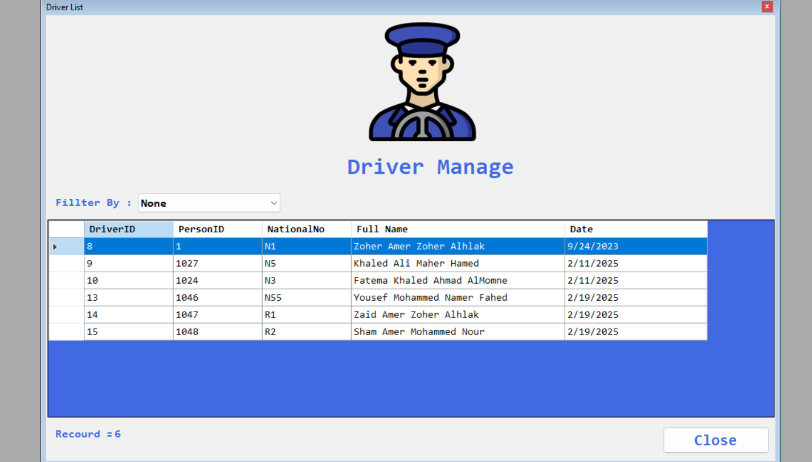
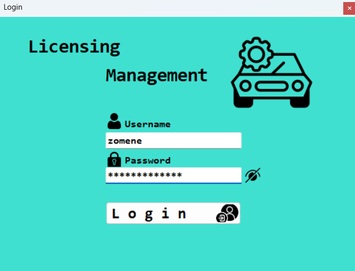
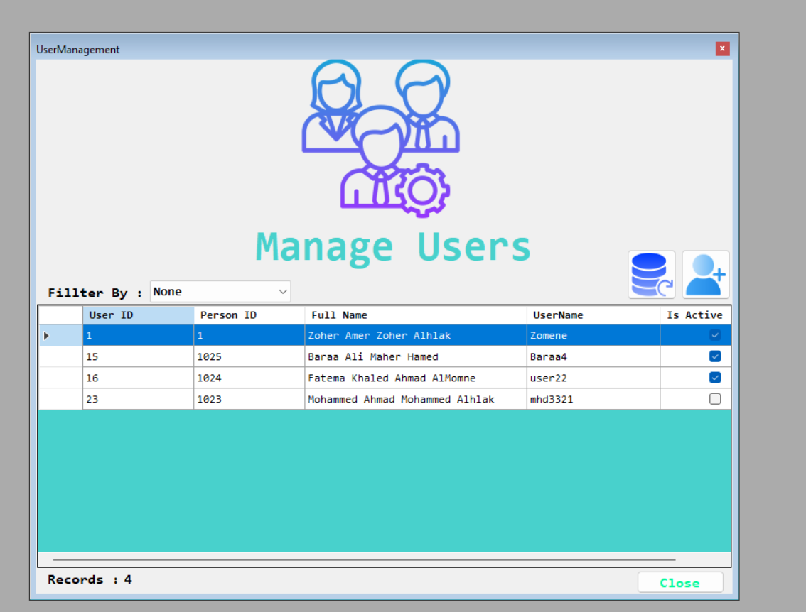
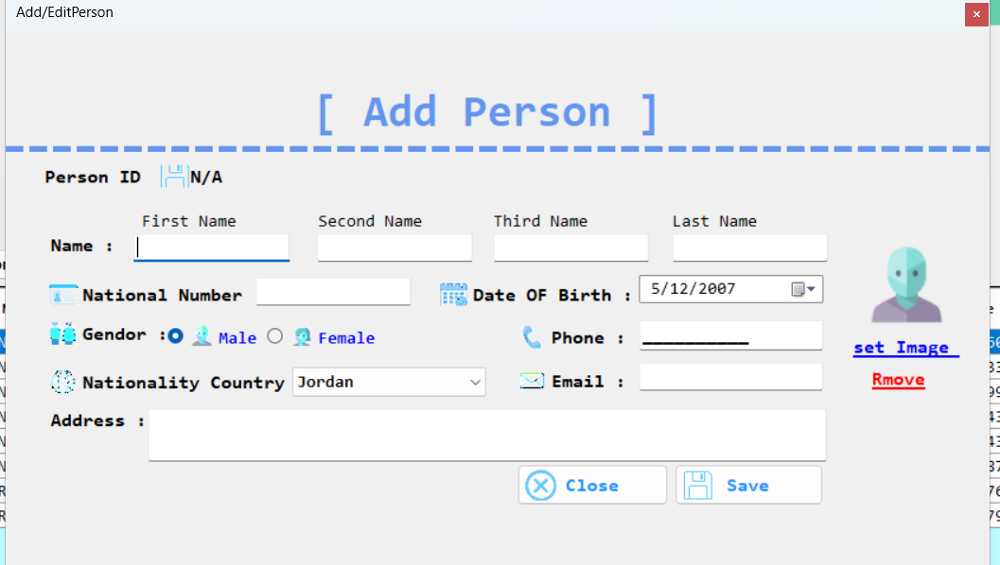
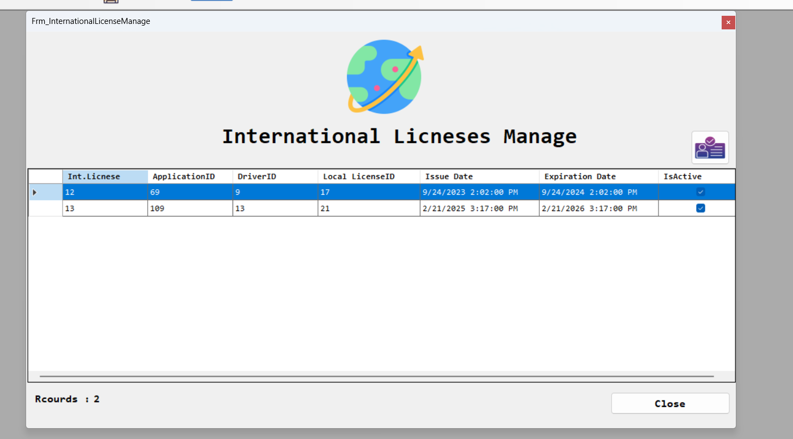

# Driver Management System 🚗

The **Driver Management System** is a comprehensive desktop application designed to manage driver license information efficiently. Built using **C#**, **SQL Server**, **ADO.NET**, **Windows Forms**, and the **.NET Framework**, this project follows a clean and scalable **3-Layer Architecture** (Presentation Layer, Business Logic Layer, Data Access Layer), ensuring a modular and maintainable codebase.

The main objective of the system is to streamline the management of driver data, offering features such as adding, updating, and deleting driver records, as well as searching and filtering the database dynamically. With a focus on performance, security, and usability, the system is designed to handle real-world requirements and provide a stable solution for businesses.

## 🔥 Key Features:
- Add, edit, and delete driver information with ease.
- Advanced search and filtering capabilities for faster data retrieval.
- Secure database access and operations through **ADO.NET**.
- A well-structured 3-layer architecture for better organization and maintainability.
- Clean, scalable codebase leveraging **Windows Forms** and the **.NET Framework**.
- User-friendly error handling and intuitive feedback for a smooth experience.
- Optimized SQL queries for improved database performance.

## 🛠️ Technologies Used:
- **C#** – The primary programming language for application logic.
- **SQL Server** – Reliable database management for storing driver data.
- **ADO.NET** – Efficient and secure data access for interaction with the database.
- **Windows Forms** – Platform for building the desktop graphical user interface (GUI).
- **.NET Framework** – Framework that provides stability and tools for developing desktop applications.
- **3-Layer Architecture** – A professional design pattern for clean, scalable, and maintainable software.

This project represents a solid example of my ability to build real-world software solutions, focusing on both backend architecture and frontend user experience. By publishing this project on GitHub, I aim to showcase my skills in **C#**, **SQL Server**, and **Windows Forms**, while contributing educational material for other developers looking to build similar systems.

Through this project, I continue to grow as a software engineer, aiming to create functional, maintainable, and scalable systems that meet real-world needs.

##Some Images :

---

Feel free to clone or fork this project and contribute if you'd like! Contributions are always welcome. 

